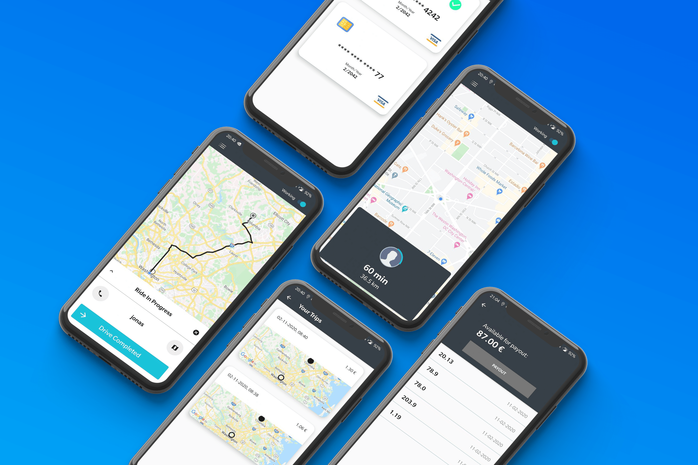

<!-- PROJECT LOGO -->
 

  

  <h3 align="center">Uber Clone</h3>

  

    A Taxi app for student made with android studio, google maps and firebase
     
    <a href="https://github.com/IFitri/UniCab/wiki"><strong>Explore the docs »</strong></a>
     
     
    <a href="https://github.com/IFitri/UniCab/issues">Report Bug</a>
    ·
    <a href="https://github.com/IFitri/UniCab/issues">Request Feature</a>
  

<!-- TABLE OF CONTENTS -->

  
<h2 style="display: inline-block">Table of Contents</h2>

  <ol>
    <li>
      <a href="#about-the-project">About The Project</a>
      <ul>
      </ul>
    </li>
    <li>
      <a href="#Features">Features</a>
      <ul>
      </ul>
    </li>
    <li>
      <a href="#Getting Started">Getting Started</a>
      <ul>
        <li><a href="#prerequisites">Prerequisites</a></li>
        <li><a href="#installation">Installation</a></li>
      </ul>
    </li>
    <li><a href="#roadmap">Roadmap</a></li>
 
    
  </ol>

<!-- ABOUT THE PROJECT -->
## **About The Project**

today we confront a pressing challenge that affects our future—Sustainable Development Goal 8: Decent Work and Economic Growth. Despite advancements, youth unemployment remains alarmingly high, leaving millions of young people without opportunities to thrive. This gap not only stifles individual potential but also hinders economic progress and social stability.

This app functions as a solution to the problems of youth unemployment and the need for flexible work opportunities. By providing a platform for students to work as taxi drivers and food riders, it empowers them to earn income while balancing their studies. With user-friendly features, real-time job notifications, and a supportive community, this app not only helps students gain valuable work experience but also fosters financial independence. It’s more than just a job; it’s a step towards a sustainable future for our youth.

<!-- Features -->
## **Features**

**Simple registration**
We want to create best app student to get money by becoming our drivers.
 
**Flexible working hours**
Allows you to work whenever(not yet) and wherever you want. You can set your own schedule that fit your availability.

**Easy earnings**
you can earn competitive rates for every one of your cab sessions

**Real-time tracking system**
real-time tracking system allows you to stay up-to-date with your plan your route more efficiently.

- ## **Getting Started**

- ### **Prerequisites**

  - [Android Studio](https://developer.android.com/)
  - [Firebase](https://firebase.google.com/)

<!-- GETTING STARTED -->

- ### **Installation**

  In order to deploy the project you'll need to follow the [wiki page](https://github.com/IFitri/UniCab/wiki/Installation-UniCab) dedicated to this effect.

- ## **Roadmap**

See the

